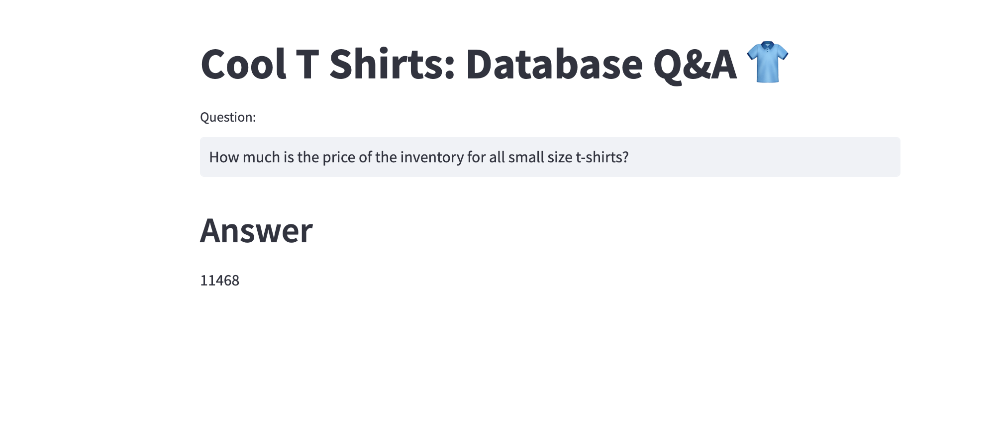

1. # Same Drill install packages
```bash
  pip install -r requirements.txt
```
2. # Get ready with some ready check my database folder

3. # get API key from makersuite.google.com and set in .env
```bash
  GOOGLE_API_KEY="your_api_key_here"
```
4. Run the Streamlit and get ready to see cool UI:
```bash
streamlit run main.py

```

